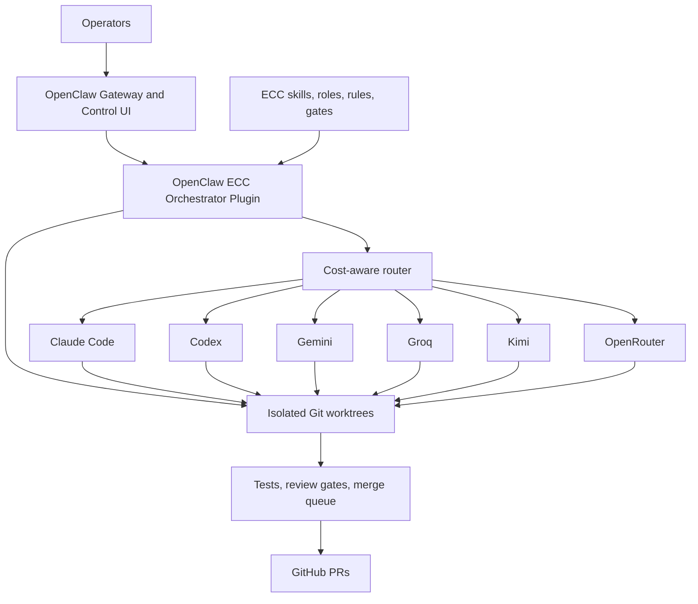

# ECC + OpenClaw Agent Control Plane Migration Specification

**Status:** Draft for implementation  
**Owner:** Kenny Hill Jr.  
**Created:** 2026-09-23  
**Source platform:** `/Users/bkh223/Documents/GitHub/agent-engineers`  
**Target infrastructure repository:** `agent-control-plane-infra`  
**Target runtime repository:** `openclaw-ecc-orchestrator`

## 1. Objective

Replace Agent-Engineers with a maintainable multiplayer coding platform that
uses:

- **ECC** for shared skills, agent roles, engineering rules, task decomposition,
  review gates, and handoff conventions;
- **OpenClaw 2.0+** for persistent sessions, multi-user ownership, approvals,
  model/provider configuration, worker placement, remote execution, and the
  operator UI;
- **native coding harnesses** such as Claude Code and Codex for repository
  mutation;
- **lower-cost model workers** such as Gemini Flash, Groq, Codex Luna, and
  approved OpenRouter models for bounded low-risk work;
- **Git branches, worktrees, and pull requests** as the source-of-truth
  isolation and integration boundary.

The system must choose economical models automatically. The operator should not
need to request a cheaper model for normal work. High-cost models are reserved
for objectively complex or high-risk tasks and escalations.

## 2. Non-goals

The migration will not create:

- another general chat application;
- another identity or session database;
- a fork of ECC;
- a fork of OpenClaw;
- a second provider SDK abstraction when a maintained native CLI is suitable;
- a replacement for GitHub pull requests or branch protection;
- multi-tenant SaaS billing;
- Windsurf, Pi, Aider, Goose, or OpenCode support during the initial migration;
- compatibility shims for unused Agent-Engineers features.

## 3. Current-state inventory

As verified on 2026-09-23:

| Component | Current state | Migration consequence |
|---|---|---|
| OpenClaw | Installed at `2026.2.3-1` | Predates OpenClaw 2.0 (`2026.8.1`); upgrade must be staged and backed up. |
| OpenClaw state | Present under `~/.openclaw` | Back up and migrate; never commit it. |
| ECC in Claude | Not installed | Install once through the native Claude plugin path. |
| ECC in Codex | Not installed | Install once through Codex's native plugin path. |
| Claude Code | `2.1.112`, Claude Max authentication | Authenticated, but non-interactive probes hang; diagnose before production use. |
| Codex desktop CLI | `0.155.0-alpha.2.6`, authenticated | Usable via the desktop-bundled binary. |
| Global Codex CLI | npm wrapper present, platform binary missing | Repair or replace with a stable wrapper to the desktop binary. |
| Gemini API bridge | Live request succeeds | Retain; use economical models by default. |
| Gemini CLI | Installed but not authenticated | Optional; API runner may remain primary. |
| Groq | Credential and API work | Replace retired default model and use model discovery. |
| Kimi | Integration code exists | Connect credential, certify, and retain only if it adds measured value. |
| OpenRouter | Live request succeeds | Fallback/review only; pin approved models. |
| Direct OpenAI API | Live request succeeds | Disable for routine coding when subscription-backed Codex suffices. |
| `tmux` | Installed | Available for local supervision. |
| `dmux` | Not installed | Optional; install only if it improves local operator workflow. |
| Agent-Engineers | Broad custom platform with stale bridges | Extract policies, then disable and archive. |

## 4. Target repository boundaries

### 4.1 `agent-control-plane-infra` (private)

Owns operational configuration and automation:

```text
agent-control-plane-infra/
  MIGRATION_SPEC.md
  TODO.md
  USER_ACTIONS.md
  inventories/
  config/
    openclaw/
    routing/
    repositories/
  scripts/
    preflight/
    backup/
    install/
    migrate/
    verify/
    rollback/
    retire/
  runbooks/
  schemas/
  tests/
```

This repository contains secret **references and variable names**, never secret
values. It may contain sanitized inventory reports. It does not contain
OpenClaw databases, transcripts, worktrees, or backups.

### 4.2 `openclaw-ecc-orchestrator` (reusable code)

Owns the thin runtime/plugin layer:

```text
openclaw-ecc-orchestrator/
  src/
    plugin/
    tasks/
    routing/
    runners/
    worktrees/
    gates/
    handoffs/
    merge_queue/
  schemas/
  tests/
  fixtures/
  docs/
```

It must not contain personal paths, credentials, provider accounts, or the
configuration of a specific private repository.

### 4.3 Application repositories

Each application remains independent. It contains only:

- its `AGENTS.md`;
- optional ECC project rules;
- `.orchestration/config.yaml`;
- durable run records under `.orchestration/runs/` when desired;
- normal CI configuration.

Generated worktrees live outside all repositories under an operator-configured
root such as `~/agent-worktrees`. They never live beneath `~/.openclaw`.

## 5. System architecture



OpenClaw owns durable sessions, ownership, approvals, and worker placement. ECC
owns workflow doctrine. The orchestrator plugin connects them to Git without
reimplementing either platform.

## 6. Safety and operating invariants

1. One implementation work unit equals one branch and one worktree.
2. Parallel workers never edit the same checkout.
3. The active orchestrator does not silently take over a failed worker's files;
   it records a handoff and explicitly reassigns the unit.
4. No secret value appears in Git, prompts, logs, handoffs, status files, or
   model-visible configuration.
5. Provider credentials are scoped to their provider and agent.
6. Cheap models cannot complete high-risk work without an independent qualified
   review.
7. Tests and declared gates block merges; warnings alone are insufficient.
8. Destructive cleanup refuses to remove unique uncommitted work.
9. OpenClaw multiplayer ownership is treated as coordination, not a security
   boundary. Separate agents or gateways protect distinct trust domains.
10. Every mutation supports dry-run or preflight wherever technically possible.
11. Every migration phase has a verified rollback before the next phase starts.
12. Agent-Engineers remains available read-only until the replacement pilot and
    credential rotation are complete.

## 7. Automation interface

All operational commands will be exposed through one repository-local command,
for example `./bin/agent-platform`, with subcommands:

```text
inventory             Collect sanitized current-state inventory
preflight             Validate prerequisites without changing state
backup                Create encrypted/local operational backup
upgrade-openclaw      Stage and verify an OpenClaw upgrade
install-ecc           Install/verify ECC for one harness
runner-doctor         Certify every configured worker
models-refresh        Refresh model availability and cost metadata
configure-agents      Reconcile the declared OpenClaw agent roster
migrate-secrets       Move secret references through approved stores
create-run            Validate a plan and create durable run state
dispatch              Assign a work unit and create a worktree
verify                Run the unit's declared quality gates
review                Assign a different-provider reviewer
merge                 Queue and integrate a verified unit
cleanup               Archive run state and safely remove worktrees
retire-agent-engineers Disable and archive the old platform
rollback              Restore a named migration checkpoint
doctor                Verify the complete platform
```

Every mutating subcommand must support:

```text
--dry-run
--json
--verbose
--backup-dir <path>
--yes                  Only for previously reviewed, non-destructive plans
```

`--yes` is accepted only with `--review-id <id>`. The review record must contain
the SHA-256 hash of the exact generated plan, an approving operator identity,
an approval timestamp, and `destructive: false`. The command recomputes the plan
hash before execution. Destructive plans always require an interactive or
separately admitted OpenClaw approval and ignore `--yes`.

Automation results use a stable envelope:

```json
{
  "ok": true,
  "operation": "install-ecc",
  "changed": false,
  "checks": [],
  "warnings": [],
  "required_user_actions": [],
  "rollback_checkpoint": null
}
```

## 8. Work-unit and handoff contracts

### 8.1 Work unit

```yaml
schema_version: "1.0"
id: P1-03
title: Bounded atomic downloader
depends_on: []
scope:
  files:
    - research_mcp/security.py
    - tests/test_security_foundation.py
acceptance:
  commands:
    - pytest -q tests/test_security_foundation.py
risk: high
capabilities:
  network: false
  secrets: []
routing:
  initial_tier: 2
  maximum_tier: 2
  reviewer_must_differ_from_author: true
budget:
  attempts: 2
  minutes: 45
  maximum_cost_usd: 3.00
rollback: Remove the additive module and tests.
```

### 8.2 Handoff

Every worker writes a structured handoff containing:

- outcome and status;
- files changed;
- behavior implemented;
- commands executed and exact results;
- unresolved failures;
- assumptions and risks;
- suggested next action;
- commit SHA, branch, and worktree;
- usage and cost when available;
- whether user input is required.

The orchestrator validates the handoff schema before considering the unit done.

Repository policy is read from `.orchestration/config.yaml`. At minimum it
defines high-risk path globs, protected commands, required checks, allowed
providers, and budget ceilings. Example:

```yaml
high_risk_paths:
  - "**/security/**"
  - "**/auth/**"
  - "**/migrations/**"
  - "server.py"
required_checks:
  - test
  - lint
protected_commands:
  - "git push --force*"
```

## 9. Cost-aware model routing

Cost-aware routing is mandatory and automatic.

### 9.1 Tiers

| Tier | Work | Preferred models |
|---|---|---|
| 0: economical | Fixtures, docs, formatting, schema snapshots, small tests, simple adapters, summaries | Groq `gpt-oss-20b`/Qwen, Gemini Flash, Codex Luna, approved low-cost OpenRouter |
| 1: standard | Normal multi-file features, typed models, repositories, integration tests | Codex Sol, Claude Sonnet, stronger Gemini, Kimi when context warrants |
| 2: advanced | Architecture, security, auth, migrations, concurrency, failed integrations | Claude Opus, Codex Astra, strongest approved Gemini; independent reviewer required |

Model identifiers are discovered dynamically. Configuration refers to capability
classes and preferences rather than assuming a provider model remains available.

### 9.2 Complexity score

| Signal | Points |
|---|---:|
| Mechanical change in at most three files | -2 |
| Deterministic fixture/test generation | -2 |
| More than three files | +1 |
| Three or more modules | +2 |
| More than 300 changed lines | +1 |
| Database/schema/migration | +3 |
| Authentication/secrets/security | +4 |
| Concurrency/process management | +3 |
| Architecture/public contract change | +3 |
| No deterministic acceptance test | +2 |
| Previous verified attempt failed | +2 |

Scores at or below zero start at Tier 0; scores 1-5 start at Tier 1; scores 6+
start at Tier 2. Repository high-risk-path rules may force Tier 2.

The declared `risk` field is an input and a minimum-tier override: `high` forces
Tier 2, `medium` forces at least Tier 1, and `low` permits score-based selection.
A match against any configured high-risk path also forces `risk: high`. Neither
the score nor a model may downgrade an explicit or path-derived minimum tier.

### 9.3 Escalation

1. Start at the lowest allowed tier.
2. Permit one implementation attempt and one repair using verification output.
3. Escalate one tier only after an objective failure.
4. Stop at the unit's maximum tier or cost/time budget.
5. Record the reason, attempts, elapsed time, usage, and target model.

Repeated cheap retries are forbidden when their projected cost exceeds one
stronger attempt.

### 9.4 Review independence

Prefer a reviewer from a different provider family. Tier 0 may review small,
deterministic diffs. Security, migration, authentication, and architecture
changes require Tier 2 review regardless of author.

### 9.5 Provider policy

- **Claude:** retain; Haiku for cheap coordination, Sonnet for standard work,
  Opus for advanced work. Production enablement requires resolving the current
  CLI hang.
- **Codex:** retain; Luna/Sol/Astra-style capability tiers. Use the desktop CLI
  until the global installation is repaired.
- **Gemini:** retain; Flash is a principal low-cost worker.
- **Groq:** retain; dynamic model discovery, fast low-risk tasks, test creation,
  and validation. Never use it alone for high-risk code.
- **Kimi:** conditional; retain if live certification demonstrates meaningful
  long-context quality or cost advantage.
- **OpenRouter:** fallback/review only with approved pinned models and data
  policy. Never route sensitive code to arbitrary free models.
- **Direct OpenAI API:** disabled for routine coding when Codex subscription
  execution suffices; retain only for an explicit API-only capability.
- **Windsurf:** retired with no compatibility path.
- **Pi:** retired; the installed command is not a usable coding agent.

## 10. Migration phases

### Phase 0: Freeze, inventory, and checkpoint

Automation:

- capture sanitized versions, paths, agents, plugins, jobs, bindings, providers,
  and model configuration;
- record current Git state in Agent-Engineers and active application projects;
- preserve the partial research-server modernization on a dedicated branch;
- create checksums of configuration and state backups;
- generate a no-change preflight report.

Gate: backups restore in a disposable location and no secret appears in the
report.

#### Backup and restore procedure

The backup command performs these steps without printing secret values:

1. Record `openclaw --version`, `openclaw gateway status`, installed plugins,
   agents, bindings, jobs, and a redacted configuration inventory.
2. Stop the Gateway cleanly so SQLite and JSON state are quiescent.
3. Copy `~/.openclaw` into a newly created operator-selected backup directory
   with mode `0700`, excluding transient sockets and caches.
4. Create a compressed archive, manifest of file modes/sizes, and SHA-256
   checksum file. Encryption is required if the destination is synchronized or
   leaves the host.
5. Restart the original Gateway and require the pre-backup status checks to pass.
6. Restore into a disposable alternate `OPENCLAW_STATE_DIR`, start an isolated
   Gateway on a non-production port, and run the doctor checks below.
7. Delete neither source nor backup automatically.

Restore copies into a new empty state directory; it never overlays a live state
directory. Promotion of a restored directory requires a separate approval.

### Phase 1: Upgrade OpenClaw

Because the installed `2026.2.3-1` predates OpenClaw 2.0, perform a staged
upgrade:

1. Upgrade to pinned `2026.8.1`, the OpenClaw 2.0 baseline.
2. Validate configuration migrations, sessions, jobs, devices, UI, and Gateway.
3. Evaluate the current stable release separately; do not follow a beta tag
   without an explicit decision.

Automation performs backup, preflight, install, restart, smoke tests, and report.
It does not approve OS prompts or destructive recovery.

Gate criteria:

- `openclaw gateway status` reports a running Gateway without fatal errors;
- `openclaw doctor` exits zero with no critical finding;
- the Control UI loads from its configured trusted endpoint;
- a disposable session can accept a prompt, persist, and reopen;
- existing session and scheduled-job counts match the preflight inventory;
- a disposable scheduled job runs once and records success;
- configured paired devices remain listed;
- the isolated rollback rehearsal satisfies the same CLI checks and inventory
  reconciliation without modifying production state.

### Phase 2: Install ECC

- Claude: native plugin installation at one chosen scope.
- Codex: native marketplace/plugin installation using the working binary.
- Kimi: project-local ECC target after credential configuration.
- Never combine native plugin, manual copy, and legacy sync methods.

Gate: each harness reports exactly one ECC installation and passes ECC doctor or
audit.

### Phase 3: Certify runners

Each runner must pass:

1. installed/version check;
2. authentication check;
3. live minimal inference;
4. disposable repository read/edit/test/commit exercise when it is a coding
   runner;
5. cancellation and timeout test;
6. no-secret log inspection;
7. cost/model metadata capture.

Uncertified runners are excluded automatically rather than represented as
degraded-but-available.

Gate: Claude and Codex pass coding certification; at least two economical
workers pass bounded-task certification.

### Phase 4: Implement the orchestrator plugin

Build, test, and package:

- plan/DAG validation;
- durable run state;
- cost-aware routing;
- health-based fallback and circuit breakers;
- worktree lifecycle;
- process execution and cancellation;
- structured handoffs;
- quality gates;
- independent review;
- conflict prediction;
- merge queue;
- OpenClaw progress and approval events.

Gate: deterministic integration tests exercise success, failure, cancellation,
reassignment, conflict, budget exhaustion, and restart/resume.

### Phase 5: Configure OpenClaw agents and multiplayer policy

Initial roster:

- conductor;
- architect;
- Claude implementer;
- Codex implementer;
- economical worker pool;
- reviewer;
- security reviewer;
- release manager.

Configure separate agent state and explicit tool/credential scopes. Define
operator roles, owners, reviewers, and approval rights. Remote access remains
loopback-only until a separate Tailscale/TLS review passes.

Gate: two operators can observe/assign work without gaining unintended secret or
filesystem access.

### Phase 6: Pilot

Use `my-research-mcp-server` as the pilot, but do not store platform code in that
repository. Run three independent modernization units:

- bounded downloader;
- typed errors/contracts;
- MCP schema contract tests.

Measure first-attempt success, escalation, conflicts, test outcomes, human
interventions, time, and cost. Correct the platform before widening the pilot.

Gate: all three units complete through separate worktrees, independent review,
and sequential integration with durable handoffs.

### Phase 7: Retire Agent-Engineers

Extract only:

- routing decision concepts;
- provider fallback intent;
- audit record fields;
- useful role prompts after review;
- budget-policy ideas.

Then:

- tag/archive the repository;
- disable daemons, startup entries, jobs, and active integrations;
- remove it from routing;
- rotate every credential formerly stored in its `.env`;
- verify no process or automation depends on it;
- retain the archive read-only for a defined period.

Gate: a dependency scan finds no active reference and all migrated credentials
have been rotated.

### Phase 8: Production rollout

- add repositories one at a time;
- require repository-local routing and gate policy;
- enable remote/cloud workers only after security review;
- introduce Swarm only after ordinary DAG execution is reliable;
- publish operator, incident, backup, and recovery runbooks;
- schedule recurring doctor and model-catalog refresh jobs.

## 11. Secrets migration

The migration tool reads secret names from Agent-Engineers and maps them to an
approved OpenClaw credential or external secret-store reference. It never prints
values or writes them to this repository.

Required controls:

- exact provider scope;
- separate production and test credentials;
- least privilege;
- log redaction;
- no secrets in subprocess arguments where avoidable;
- no inheritance of unrelated credentials by worker processes;
- rotation after migration;
- revocation of unused Agent-Engineers credentials.

Only the operator may enter, approve, rotate, or revoke credentials.

## 12. CI and quality gates

Both new repositories require:

- unit and integration tests;
- coverage threshold of at least 80% for new code;
- formatter, lint, and type checking;
- secret scanning;
- dependency vulnerability scanning;
- SBOM generation;
- schema validation;
- shell-script static analysis where applicable;
- tests proving dry-run does not mutate state;
- tests proving cleanup preserves unique work;
- adversarial tests for path traversal, command injection, log leakage, forged
  handoffs, stale model names, and approval confusion.

Adversarial tests live under `tests/adversarial/` and use table-driven malicious
fixtures plus property-based generation for paths, shell arguments, task files,
handoffs, and provider responses. Subprocess execution must use argument arrays,
never interpolated shell strings. CI runs secret-pattern scanning against logs
and artifacts, mutates signed handoffs and approval records to prove rejection,
injects removed model names into provider catalogs, and tests confused-deputy
cases where an approval from another user/session/task is replayed.

“New code” coverage means lines added or modified by the pull-request diff,
excluding comments and blank lines, measured with language-appropriate diff
coverage tooling. Diff coverage must be at least 80%, and the ordinary full-suite
coverage may not decrease. High-risk platform changes require an independent
provider review and human approval before merge.

## 13. Observability and success metrics

Track:

- tasks by tier/provider/model;
- first-attempt and final success rates;
- escalation reason and frequency;
- review rejection rate;
- test failures;
- retries, timeouts, and cancellations;
- median queue and execution duration;
- tokens and cost where reported;
- worker health and provider rate limits;
- worktree leaks and merge conflicts;
- human interventions;
- percentage completed at Tier 0.

Initial targets:

- at least 50% of routine bounded units complete at Tier 0;
- at least 80% of all units complete without escalation;
- fewer than 10% use Tier 2;
- no high-risk unit completes solely at Tier 0;
- no merge bypasses required verification;
- zero committed secrets;
- zero lost unique work during cleanup.

## 14. Rollback strategy

Every phase creates a named checkpoint with:

- versions;
- sanitized config snapshot;
- backup location and checksum;
- completed checks;
- restore command;
- expected post-restore state.

Rollback never deletes the newer state until the restored state passes doctor.
For rollback, “passes doctor” means `openclaw doctor` and `openclaw gateway
status` exit zero, configuration parsing has no critical finding, the isolated
Gateway can create and reopen a disposable session, and inventory reconciliation
shows the expected agents, jobs, plugins, and historical sessions. Warnings must
be explicitly allowlisted in the checkpoint; an empty warning list is preferred.
Agent-Engineers is not disabled until the OpenClaw pilot succeeds. Credentials
are not revoked until replacement runners pass live certification.

## 15. Exact operator actions

The operator-only instructions are maintained in `USER_ACTIONS.md`. Automation
must generate a current subset of that checklist based on detected state. It
must never ask the operator to paste a secret into a model conversation.

## 16. Definition of done

The migration is complete when:

- OpenClaw runs a verified OpenClaw 2.0+ release with tested rollback;
- ECC is installed exactly once in each selected native harness;
- Claude and Codex pass coding-runner certification;
- at least Gemini and Groq pass economical-worker certification;
- Kimi is either certified with a documented role or formally retired;
- the orchestrator resumes runs after restart and after changing conductors;
- every implementation unit uses an isolated branch/worktree;
- cost-aware routing and evidence-based escalation occur automatically;
- independent review and repository gates block unsafe merges;
- multiplayer ownership and approvals are visible and auditable;
- the research MCP pilot succeeds;
- Agent-Engineers is archived and disabled;
- migrated credentials are rotated;
- all infrastructure and runtime code lives in the two new repositories;
- all TODOs are either complete or explicitly moved to a post-migration backlog.
